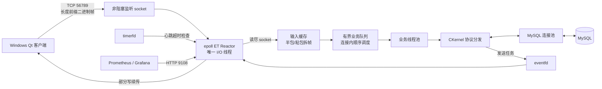

# IM Linux 高并发服务端

[](https://github.com/94Luhr/im/actions/workflows/ci.yml)

这是一个由 Windows Qt IM 客户端演进而来的 Linux C++17 服务端。项目使用 `epoll` ET Reactor、非阻塞 I/O、业务线程池和 MySQL 连接池，完整实现注册登录、好友关系、实时聊天、离线消息、历史记录和可靠 ACK，并提供压测、结构化日志、Prometheus/Grafana 监控、CI 与 systemd 部署方案。

> 项目重点不是堆叠业务页面，而是展示一个可解释、可测试、可观测的高并发网络服务端如何处理连接、并发、背压和消息可靠性。

## 核心能力

- **高并发网络层**：单 Reactor 线程管理全部 socket，使用 `epoll` ET、非阻塞 `accept/recv/send`、输入缓存和输出队列。
- **跨线程协作**：完整协议帧进入有界 worker 队列；业务线程通过 `eventfd` 唤醒 Reactor，socket 始终由 I/O 线程独占。
- **顺序与连接安全**：同一连接的协议包串行处理，不同连接并行处理；使用单调递增 `connectionId` 防止 fd 复用导致旧任务误发。
- **流量保护**：限制单连接输出缓存和全局业务队列；支持慢客户端断开、登录限流、非法包长校验及 `EMFILE/ENFILE` 退避。
- **可靠消息**：消息先写入 MySQL，在线实时投递、离线登录补发，客户端 ACK 后更新送达状态；好友申请及处理结果采用相同的持久化补发机制。
- **账号安全**：新密码采用随机盐和 120000 轮 PBKDF2-HMAC-SHA256；旧 SHA-256 密码首次成功登录后自动升级。
- **可观测与可部署**：JSON 结构化日志、Prometheus 指标端点、Grafana 仪表盘、systemd 服务模板和 GitHub Actions 集成测试。

## 总体架构



详细的线程模型、请求时序、背压策略和消息可靠性设计见[架构设计](docs/架构设计.md)。

## 性能结果

测试环境为 VMware Ubuntu 24.04，2 vCPU、5.7 GiB 内存，Release 构建。

| 场景 | 并发连接 | 吞吐量 | P99 延迟 | 成功率 |
| --- | ---: | ---: | ---: | ---: |
| Linux 本机回环，心跳突发 | 5000 | 9662 响应/秒 | 28.066 ms | 100% |
| Windows 到 VMware，稳定心跳 | 5000 | 4901.94 响应/秒 | 60.599 ms | 100% |
| MySQL 消息持久化 | 100 对账号、10000 条消息 | 1130.18 条/秒 | 58.963 ms | 100% |
| 离线消息补发 | 100 对账号、10000 条消息 | 15174.63 条/秒 | — | 100% |

跨主机 5000 连接最终测试完成 148514 次请求与响应，无连接失败、异常断开、协议错误、写失败、任务积压或队列拒绝。完整环境、口径和原始数据见[性能测试报告](docs/性能测试报告.md)。

## 快速开始

### 1. 安装依赖

```bash
sudo apt update
sudo apt install -y build-essential cmake libssl-dev default-libmysqlclient-dev mysql-server
```

### 2. 初始化数据库

```bash
sudo systemctl enable --now mysql
sudo mysql < database/schema.sql
```

如果使用独立数据库账号，请授予其访问 `imdb` 的权限。旧数据库按需执行 `database/` 下的迁移脚本。

### 3. 构建

```bash
cmake -S . -B build -DCMAKE_BUILD_TYPE=Release
cmake --build build --parallel 2
```

### 4. 启动

`ulimit` 必须与服务端启动命令位于同一个 Shell：

```bash
ulimit -n 65535

export IM_DB_HOST=127.0.0.1
export IM_DB_USER=imserver
export IM_DB_PASSWORD='替换为数据库密码'
export IM_DB_NAME=imdb

./build/im_server_linux
```

启动成功后，业务端口为 `56789`，Prometheus 指标端口为 `9108`：

```bash
curl http://127.0.0.1:9108/metrics
```

## 配置项

| 环境变量 | 默认值 | 说明 |
| --- | ---: | --- |
| `IM_DB_HOST` | `127.0.0.1` | MySQL 地址 |
| `IM_DB_USER` | `imserver` | MySQL 用户 |
| `IM_DB_PASSWORD` | 空 | MySQL 密码，生产环境必须显式设置 |
| `IM_DB_NAME` | `imdb` | 数据库名称 |
| `IM_DB_POOL_SIZE` | `4` | 数据库连接池容量，范围 1–64 |
| `IM_WORKER_THREADS` | `4` | 业务工作线程数，范围 1–64 |
| `IM_MAX_PENDING_JOBS` | `10000` | 全局待处理任务上限，范围 1–1000000 |
| `IM_METRICS_PORT` | `9108` | Prometheus HTTP 指标端口 |

## 测试

核心业务一键集成测试覆盖登录、消息持久化、离线补发、ACK 去重、历史分页、离线好友申请、好友结果补发和登录限流：

```bash
export IM_DB_USER=imserver
export IM_DB_PASSWORD='替换为数据库密码'
bash tests/run_integration_test.sh --output integration-report.json
```

心跳并发压测示例：

```bash
python3 tests/load_test.py \
  --host 127.0.0.1 \
  --connections 1000 \
  --duration 30 \
  --interval 1 \
  --burst 2 \
  --fragment-ratio 0.1 \
  --output load-test-report.json
```

更多测试方法见[测试说明](tests/README.md)。CI 会在 Ubuntu 24.04 与 MySQL 8 环境中完成 Release 构建和核心业务回归。

## 监控与部署

- Prometheus/Grafana：[monitoring/README.md](monitoring/README.md)
- systemd 生产部署：[deploy/README.md](deploy/README.md)
- 每次迭代记录：[docs/功能实现记录.md](docs/功能实现记录.md)
- 简历描述与面试讲解：[docs/简历与面试材料.md](docs/简历与面试材料.md)

## 目录结构

```text
.
├── net/            # epoll Reactor、连接状态、拆包、非阻塞收发
├── mediator/       # 网络层与业务层解耦
├── MySQL/          # MySQL 连接与连接池封装
├── common/         # 结构化日志和服务指标
├── database/       # 完整建库脚本与增量迁移
├── tests/          # 集成测试、并发压测和业务压测
├── monitoring/     # Prometheus、Grafana与Compose配置
├── deploy/         # systemd单元和环境变量模板
├── docs/           # 架构、性能、简历与迭代记录
├── CKernel.*       # 协议分发和IM核心业务
└── LinuxMain.cpp   # Linux进程入口与优雅退出
```

## 设计边界

- 当前是单机单进程架构，在线用户路由保存在进程内存中，尚未实现多实例水平扩展。
- 业务协议采用长度前缀加C/C++结构体，已解决当前Windows/Linux布局和字节序问题，但不如 Protobuf 等IDL协议便于跨语言演进。
- 当前链路为明文TCP；TLS是后续增强项，需要同步调整Windows客户端并管理证书信任。
- 消息采用“持久化 + 补发 + ACK”的至少一次投递语义，客户端业务层应按消息ID保证幂等。

## 面试速记

一句话概括：**使用单线程 epoll 管 I/O、线程池处理业务、eventfd 回传发送任务，并通过有界队列和持久化 ACK 解决高并发下的资源控制与消息可靠性。**

更完整的三分钟讲解、常见追问和回答见[简历与面试材料](docs/简历与面试材料.md)。
