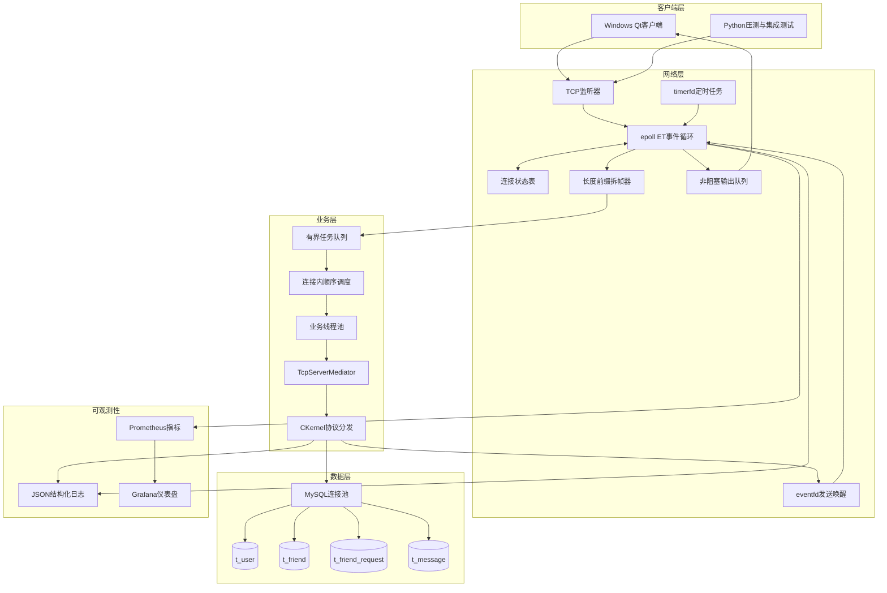
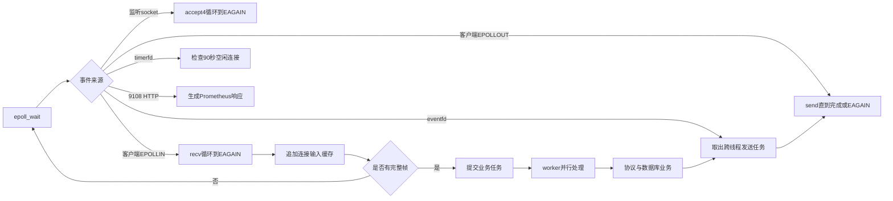
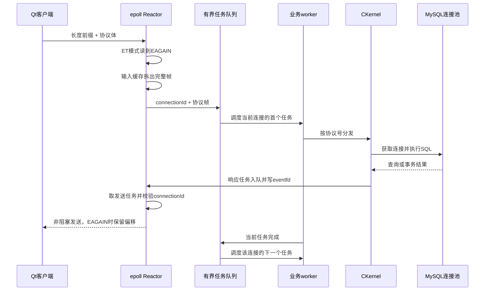
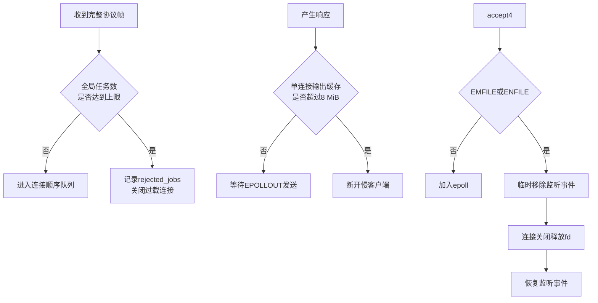
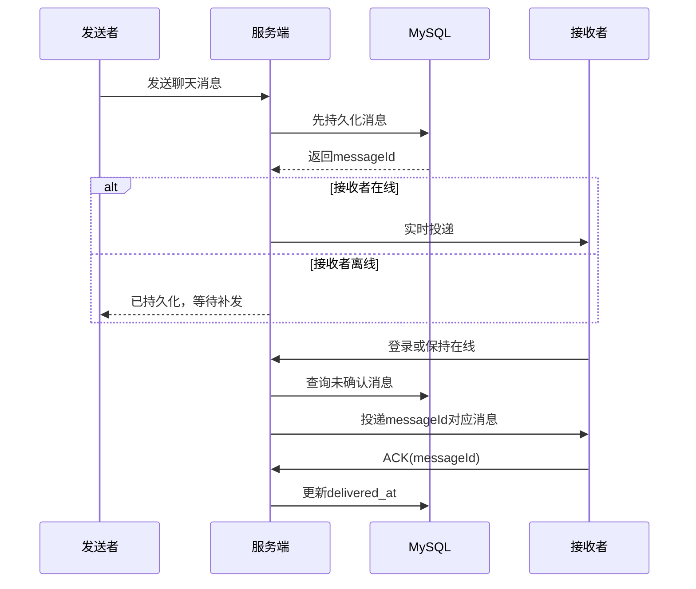

# IM Linux服务端架构设计

## 1. 设计目标

该服务端从Windows线程式网络代码迁移到Linux，目标是在保持现有Qt客户端业务协议兼容的前提下，解决以下问题：

1. 使用少量固定线程管理数千条TCP长连接。
2. 正确处理TCP半包、粘包、部分写和慢客户端。
3. 隔离I/O与数据库业务，避免慢SQL阻塞Reactor。
4. 保证同一连接内协议处理顺序，同时允许不同连接并行。
5. 对任务积压、输出积压和文件描述符耗尽实施明确背压。
6. 通过持久化、补发和ACK降低离线场景中的消息丢失风险。
7. 提供可复现测试、运行指标和部署方式，使性能结论能够被验证。

## 2. 分层结构



### 模块职责

| 模块 | 主要职责 | 并发约束 |
| --- | --- | --- |
| `EpollTcpServer` | 接受连接、非阻塞收发、拆帧、输出缓存、心跳超时 | socket仅由Reactor线程操作 |
| 业务任务队列 | 将完整协议帧从I/O线程移交给worker | 总任务数有上限 |
| 连接顺序调度 | 保存同一连接的后续任务 | 每个连接同一时刻最多一个任务执行 |
| `TcpServerMediator` | 解耦网络层和业务层 | 不保存socket所有权 |
| `CKernel` | 协议分发、登录态、聊天及好友业务 | 在线映射与限流表分别加锁 |
| `CMySql` | 连接池租借、SQL执行和故障指标 | 每次业务操作独占一个数据库连接 |

## 3. Reactor线程模型



Reactor只执行短小、非阻塞的I/O工作，不执行SQL。业务线程不能直接调用 `send`，只能提交包含 `connectionId` 和响应字节的发送任务，然后写 `eventfd` 唤醒Reactor。

这种所有权约束带来两个好处：

- epoll关注事件、连接输入输出缓存和socket关闭都只在一个线程修改，减少细粒度锁。
- 业务线程返回结果时使用连接编号而不是fd；即使旧fd已关闭并被系统复用，旧任务也无法误发给新连接。

## 4. 一个请求的完整时序



## 5. TCP帧与连接内顺序

线上的帧格式为：

```text
+------------------------+-----------------------------+
| uint32_t 网络序长度 N  | N 字节业务协议体            |
+------------------------+-----------------------------+
```

- 每个连接维护独立输入缓存；长度不足时等待下次 `EPOLLIN`，一次收到多帧时循环拆出。
- 包长必须位于合法范围，防止伪造超大长度触发过量内存分配。
- 输出由完整帧队列和队首偏移组成；`send` 返回部分长度或 `EAGAIN` 时继续等待 `EPOLLOUT`。
- `m_activeJobConnections` 标记正在执行任务的连接，后续包进入 `m_waitingJobs`；当前任务结束后才调度下一包。
- 不同连接的首任务可被不同worker同时处理，因此连接内有序不会退化成全局串行。

## 6. 背压与故障保护



保护策略强调“有界”：当服务能力不足时主动拒绝少量连接，而不是允许内存、线程或日志无限增长并拖垮整个进程。fd耗尽告警最多每5秒输出一次，避免错误日志本身形成忙循环。

## 7. 消息可靠性模型

聊天消息与好友处理结果采用“数据库状态 + 登录补发 + 客户端ACK”的至少一次投递语义。



如果连接在投递后、ACK前断开，消息可能再次出现，因此语义是至少一次而不是严格恰好一次。客户端应以 `messageId` 做幂等处理。正常关闭时，Reactor会先读尽并拆出最后一批完整数据，再把断线清理任务排到该连接任务队尾，避免尾部ACK丢失。

## 8. 数据模型

| 表 | 用途 | 关键状态 |
| --- | --- | --- |
| `t_user` | 用户账号、昵称、密码摘要 | PBKDF2编码密码 |
| `t_friend` | 双向好友关系 | 用户ID与好友ID |
| `t_friend_request` | 离线好友申请及结果通知 | 处理状态、结果送达时间 |
| `t_message` | 聊天内容、历史记录和离线补发 | 消息ID、创建时间、送达时间 |

数据库连接池将数据库并发限制在固定容量内，并输出占用数、操作数、失败数和获取超时数。网络心跳压测不访问MySQL，因此不能用网络吞吐量代替业务SQL吞吐量。

## 9. 可观测性与部署

- 日志是一行一个JSON对象，可通过事件名、连接ID和用户ID检索业务链路。
- `0.0.0.0:9108/metrics` 由同一个Reactor非阻塞处理，但监控连接不计入IM业务连接数。
- Grafana展示连接、吞吐、字节、队列、异常和数据库连接池趋势。
- systemd模板设置独立低权限用户、`LimitNOFILE=65535`、异常重启和基础沙箱保护。
- GitHub Actions在Ubuntu 24.04、MySQL 8环境中完成Release构建和核心业务集成测试。

## 10. 当前边界与演进方向

1. 当前为单实例服务，在线路由位于进程内；多实例需要引入共享在线状态、服务发现和跨节点消息路由。
2. 当前二进制结构体协议面向现有Windows/Linux客户端；后续可升级为Protobuf并增加协议版本协商。
3. 当前TCP链路未加密；启用TLS需要在Reactor中维护非阻塞握手状态，并同步改造Windows客户端证书校验。
4. 至少一次投递需要客户端按消息ID幂等；如果扩展群聊，还需设计会话序列号、未读游标和批量ACK。
5. 当前性能数据来自2核VMware环境；生产容量规划还需独立压测机、长时间稳态测试和CPU/内存火焰图。
